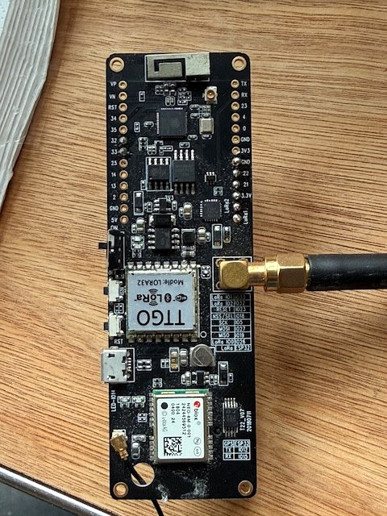
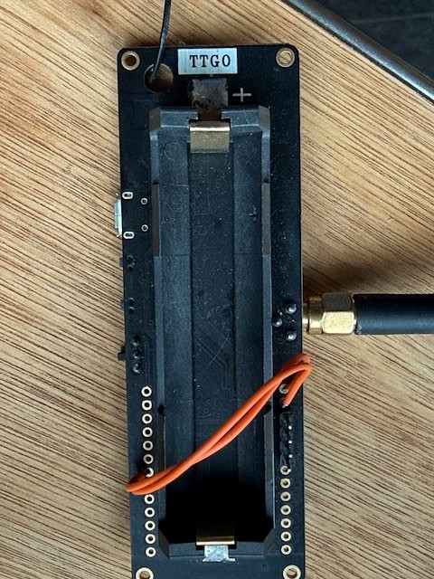

# MeshCore Companion Radio on TTGO T-Beam SX1276 (no AXP PMU)

MeshCore v1.15.0 BLE companion radio firmware, patched to run on the early TTGO T-Beam that ships **without an AXP192/AXP2101 power management IC**. This variant is often mislabelled as "T-Beam v1.1" in reseller listings but is identifiable by the absence of the AXP chip and the LoRa radio powered directly from the 3.3 V rail.

| Front | Back |
|-------|------|
|  |  |

---

## Hardware

| Component | Details |
|-----------|---------|
| MCU | ESP32-D0WDQ6 rev 1.0, dual-core 240 MHz |
| LoRa radio | Semtech SX1276 (TTGO eLORa32 module, 868 MHz) |
| GPS | u-blox NEO-6M |
| Power management | **None** — no AXP192/AXP2101 PMU |
| Flash | 4 MB |
| Battery | 18650 holder (back), JST connector |
| USB | Micro-USB (CP2104 UART bridge) |

### How to identify this variant

- **AXP absent**: no I2C response at `0x34` on Wire (SDA=21, SCL=22)
- **LoRa confirmed SX1276**: Semtech RF95 — RadioLib sees it as `SX1276`; DIO2 on GPIO 32
- **No display header**: this board has no OLED populated
- The PCB silkscreen reads **TTGO** on the bottom and **TTGO eLORa Model LORA32** on the LoRa module

---

## Why standard MeshCore firmware doesn't work

MeshCore's `TBeamBoard` driver unconditionally tries to initialise an AXP2101 then AXP192 over I2C before touching the radio. On this board:

1. Both `XPowersAXP2101::init()` and `XPowersAXP192::init()` fail — the IC simply isn't there.
2. The failed I2C probes leave the ESP32 `Wire` bus in a corrupted state (`i2cSetClock(): bus is not initialized`).
3. The original code called `return false` when no PMU was found — but `TBeamBoard::begin()` ignores the return value. The real hang was `rtc_clock.begin(Wire)` in `radio_init()` blocking on the corrupted bus.
4. The bootloader shipped with the PlatformIO toolchain uses a higher brownout threshold than the release binary, causing an immediate reset before `setup()` even runs on a battery-only board.
5. After BLE connected and a client asked for battery voltage, `getBattMilliVolts()` dereferenced the null `PMU` pointer → `LoadProhibited` panic.

---

## Patches applied to MeshCore v1.15.0

All changes are in `patches/`. Apply them on top of the upstream `meshcore-dev/MeshCore` source.

### 1. `src/helpers/esp32/TBeamBoard.cpp`

**a) Disable brownout detector at start of `begin()`**

The PlatformIO bootloader's brownout threshold causes a reset before `setup()` on battery power. Disabling it in software is the correct fix for this hardware.

```cpp
// Added at top of file:
#include "soc/soc.h"
#include "soc/rtc_cntl_reg.h"

void TBeamBoard::begin() {
    WRITE_PERI_REG(RTC_CNTL_BROWN_OUT_REG, 0);  // disable brownout on boards without AXP power management
    ESP32Board::begin();
    power_init();
    ...
}
```

**b) Reset Wire bus and continue when no PMU is found**

Without this, a corrupted I2C state causes `radio_init()` to hang indefinitely.

```cpp
if (!PMU) {
    // No AXP found — LoRa powered directly from 3.3V rail (no PMU switching).
    // Reset Wire so radio_init()'s RTC scan doesn't block on the corrupted I2C state.
    Wire.end();
    Wire.begin(PIN_BOARD_SDA, PIN_BOARD_SCL);
    return true;   // <-- was: return false
}
```

### 2. `src/helpers/esp32/TBeamBoard.h`

**Null-guard on `getBattMilliVolts()`**

When BLE connects and the companion app queries battery voltage with `PMU == NULL`, the original code causes a `LoadProhibited` hard fault.

```cpp
uint16_t getBattMilliVolts() {
    if (!PMU) return 0;   // <-- added guard
    return PMU->getBattVoltage();
}
```

### 3. `variants/lilygo_tbeam_SX1276/platformio.ini`

`MESH_DEBUG` disabled for production (the debug build spams `noise_floor` every few seconds over serial).

---

## Build

Requires [PlatformIO](https://platformio.org/).

```bash
git clone https://github.com/meshcore-dev/MeshCore.git
cd MeshCore

# Apply patches
cp patches/TBeamBoard.cpp src/helpers/esp32/TBeamBoard.cpp
cp patches/TBeamBoard.h   src/helpers/esp32/TBeamBoard.h
cp patches/platformio.ini variants/lilygo_tbeam_SX1276/platformio.ini

# Build
pio run -e Tbeam_SX1276_companion_radio_ble
```

---

## Flash

Use the **release bootloader** from the official MeshCore release binary — the PlatformIO default bootloader has a higher brownout threshold that resets this board at boot.

```bash
# Extract release bootloader (from the official merged binary):
python3 -c "
with open('Tbeam_SX1276_companion_radio_ble-v1.15.0-merged.bin','rb') as f:
    f.seek(0x1000); bootloader = f.read(0x7000)
open('release_bootloader.bin','wb').write(bootloader)
"

# Flash
esptool.py --port /dev/ttyUSB0 --baud 460800 \
  write_flash --flash_mode dio --flash_freq 40m \
  0x1000  release_bootloader.bin \
  0x8000  .pio/build/Tbeam_SX1276_companion_radio_ble/partitions.bin \
  0x10000 .pio/build/Tbeam_SX1276_companion_radio_ble/firmware.bin
```

> On macOS the port is typically `/dev/tty.usbserial-XXXXXXXX`.

---

## Connect to the mesh

This firmware runs as a **BLE companion radio** — it advertises over Bluetooth and connects to any MeshCore-compatible host (phone, computer, or dedicated controller) running the [MeshCore companion app](https://github.com/meshcore-dev/meshcore-flutter).

Set node name and region (`EU_868` for 868 MHz) via the companion app on first boot.

---

## Pin reference (SX1276 variant)

| Signal | GPIO |
|--------|------|
| LORA NSS | 18 |
| LORA RESET | 23 |
| LORA DIO0 | 26 |
| LORA DIO1 | 33 |
| LORA DIO2 | 32 |
| LORA SCLK | 5 |
| LORA MISO | 19 |
| LORA MOSI | 27 |
| I2C SDA | 21 |
| I2C SCL | 22 |
| GPS RX | 12 |
| GPS TX | 34 |
| User button | 38 |
| TX LED | 4 |

---

## Credits

- [MeshCore](https://github.com/meshcore-dev/MeshCore) by meshcore-dev
- [RadioLib](https://github.com/jgromes/RadioLib)
- [XPowersLib](https://github.com/lewisxhe/XPowersLib)
- Hardware diagnosis via [Meshtastic](https://meshtastic.org/) to confirm SX1276 and absent AXP
